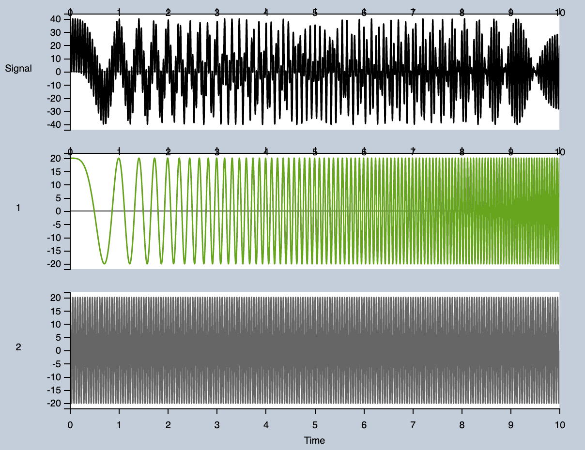
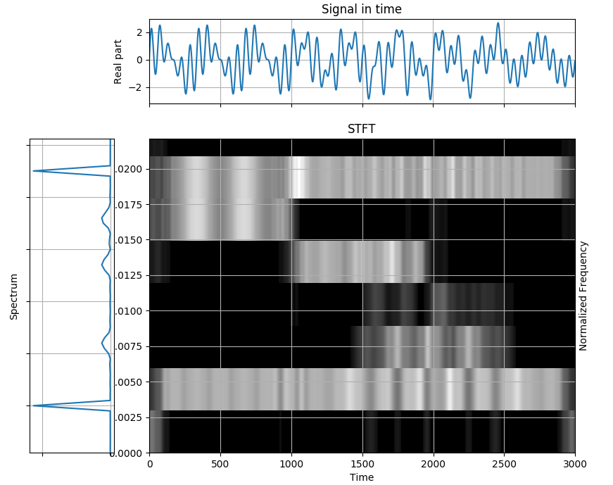
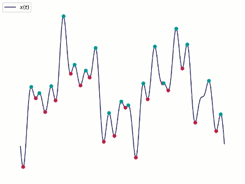
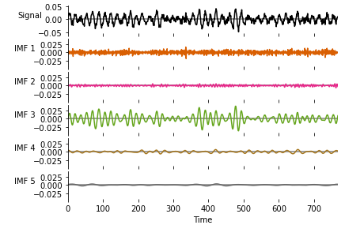
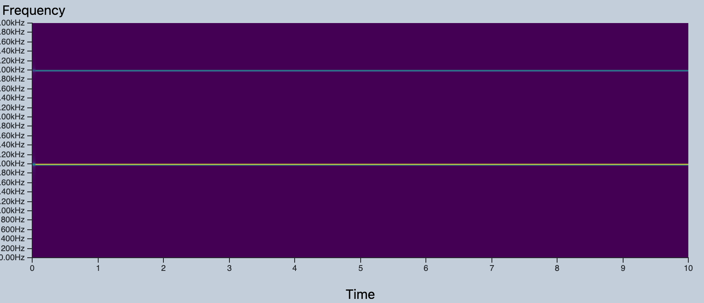

# Online Tutorial
## Motivation
As part of our F21DG coursework we have produced a front end only web application that enables the user to explore two differeent approaches to time series analysis of non-stationary and non-linear signals.
The application allows users to either submit their own signals, or to build one using a library of predefined signal types, and then perform either a Short Time Fourier Transform (STFT) or a Empirical Mode Decomposition (EMD) on the signal to break it down into it's constituent component signals.

This will allow them to explore the differences between these two methods for decomposing time signals, serving as a demonstration of their relative strengths and weakness, and providing an intuitive feel for how they work.
The application also has a number of convenience features for users, such as the ability to bookmark examples, and a built in interface tutorial.

In this online tutorial we will first explore some of the theory behind STFT and and EMD.
Then we will run through some example analyses using both generated signals and pregenerated signals as CSVs, which can be found <!-- TODO: HERE -->
Pregenerated signals can be entered manually as specified, or you can click on the link to have the sample preconfigured for you [like this](../index.html?dataMethod=config&analysisMethod=EMD&combinationMethod=sum&1-id=1&1-type=sinusoid&1-phase=0&1-frequency=100&1-amplitude=100&2-id=2&2-type=colour-noise&2-colour=brownian&2-seed=12341234&2-amprollfactor=100&2-variance=1#)

## Theory
### Time Series Analysis
A *time series* is a sequence of data points that are indexed or graphed in time order.
Frequently graphed in a run chart (a graph which features time as its `y` axis), time series occur naturally in a wide array of subjects, such as statistics, finance, weather forecasting, and signal processing.

There are a handful of common types of time series that occur widely, for example:
1. Simple sinusoids
1. Linear, exponential, logarithmic, or polynomial trends
1. White, coloured, or shot noise
1. Chirps
1. Products and sums of the above signals, forming complex signals that might be found in the real world 

*Time series analysis* is a set of techniques that can be used in order to reason about time series', enabling an analyst to extract useful insights from the data.

Many time series exhibit an oscillatory behaviour, such as the temperature of a city on any given day of the year, the share price of a given stock, or the audio data recorded by a microphone.
An analyst can exploit the fact that complex signals can be approximated with sums of simpler trigonometric functions and use Fourier analysis to decompose a signal into its oscillatory components.

When we begin to run examples by building signals through the UI, you will see that the top graph demonstrates this fact, showing the individual components and then the result of their superposition.
Below is a screenshot of our application superposing a sinusoid and a chirp, you can see this for yourself [here](../index.html?dataMethod=config&analysisMethod=STFT&1-id=1&1-type=chirp&1-frequency=0&1-rate=2&1-amplitude=20&combinationMethod=sum&2-id=2&2-type=sinusoid&2-phase=0&2-frequency=20&2-amplitude=20#).
Ignore the spectrogram for now, we will explain that later, and please feel free to explore the graph using the pan and zoom controls.

 <!-- TODO: replace with scrot from our app -->

For the rest of this theory section we will be using signals generated and analysed in a Jupyter Notebook, due to limitaions in the application (such as not having the capability of performing FFT).
Once we have gone over the theory we will begin to use the application to perform some more simple analysis.

### Discrete Fourier Transform

A Fourier transform is one way of decomposing a complex signal into its oscillatory components, revealing the frequencies of the constituent component signals.
Determining what component frequencies are present in a signal can give an insight into the nature of a signal, or allow it to be manipulated precisely.
For example, it may allow an audio engineer to silence or boost particular frequencies as they see fit, or a financial analyst to determine what kind of long term trends exist in financial data.

Lets look at an example of a Fourier transform of this complex signal.


We will use the Fast Fourier Transform (FFT) algorithm to compute the transform.


Notice that despite having a strong indication that the constant 3Hz and 18Hz signals are constituent components, much information has been lost.
As a Fourier transform maps a function from the time domain to the frequency domain, all temporal information is lost, as the FFT assumes periodicity.
This is obviously not ideal, as our complex signal is non-linear.
The Fourier transform is thus not well suited to non-linear signals when applied on the entire signal at once.

### Short Time Fourier Transform

Instead, in order to study non-stationary signals, we require a technique that can study a signal in both the time and frequency domain simultaneously.
The simplest of these techniques is the Short Time Fourier Transform (STFT).

The procedure for STFT is to divide a long time signal equally into shorter length segments, and then compute a DFT on each of these segments.
In order to smooth out any unusual artefacts at the boundary of segments, window functions such as a Hann window may be used, which attenuates signals located near boundaries using a cosine window.
With the Fourier spectra of each shorter segment, we can plot the changing spectra against time using a type of plot known as a spectrogram.
Here is an example of STFT applied to our original signal.



Here we can see the strength of each constituent signal by colour intensity.
Unlike previously with the FFT, we now have temporal information, and can see when signals of a given frequency begin and end in the complex signal.

#### STFT Limitations

However there is a significant limitation to building on top of Fourier transforms due to an uncertainty limit called the Gabor limit.
By making the time resolution smaller (i.e., by dividing the main signal into smaller windows) we become more certain of when frequencies change, but we lose frequency resolution (the ability to see frequency components close together).
By making the time resolutions larger, we lose time resolution (the ability to know precisely when a frequency changes), but we get better frequency resolution.

We will explore the Gabor limit in more depth through the use of the application later.

### Hilbert-Huang Transform and Empirical Mode Decomposition

The Hilbert-Huang Transform (HHT) is a powerful time-frequency analysis technique.
It allows an analyst to decompose a complex signal into a number of orthogonal Intrinsic Mode Frequencies (IMFs) with a trend using EMD and applies Hilbert Spectral Analysis (HSA) to the IMFs to obtain information regarding instantaneous frequency.

HHT first utilises empirical mode decomposition (EMD) in order to break a complex waveform into IMFs representing simple oscillatory modes through a process called sifting.
The amplitude and frequency of an IMF may vary with time, and must satisfy both of these rules:
1. The total number of extrema and the number of zero crossings must differ by at most 1
2. The mean envelope value (defined by a spline described by the local maxima and the local minima) must be nearly zero

The sifting procedure to extract these IMFs can be described by the following steps:
1. Initialise `r_0 = X(t)` and `i = 1`
1. Start outer loop
1. Extract the `i`th IMF `c_i`
	1. Initialise `h_{k(k-1)} = r_{i-1}`, `k = 1`
	1. Start inner loop
	1. Identify all of the local maxima and minima (the extrema)
	1. Interpolate the minima with a cubic spline in order to define the lower envelope
	1. Interpolate the maxima with a cubic spline in order to define the upper envelope
	1. Calculate the mean `m_{i(k-1)}` of the upper and lower envelopes of `h_{i(k-1)}`. The envelope defined by the two cubic splines should contain all data.
	1. Set `h_{ik} = h_{i(k-1)} - m_{i(k-1)}`
	1. Is `h_{ik}` an IMF?
		- If true, set `c_i = h_{ik}` and break
		- Else increment `k` and continue inner loop
1. Set the remainder `r_{i+1} = r_i - c_i`
1. Does `r_{i + 1}` contain at least two extrema?
	- If true increment `i` and continue outer loop
	- Else end routine, with `r_{i + 1}` as the signal residue and `c_1` through `c_i` as the IMFs

Below is a flowchart describing this algorithm[^fn1]


And below is an animation of the production of an IMF[^fn2]




The number of sifting steps required to produce an IMF is determined by the stopping criterion.
There are a number of stopping criterion that can be used for EMD, each with their own advantages and disadvantages.
The one proposed by Huang et al. (1998) however is the 'Standard Deviation' method.
For each point in time, the difference between the current component and the previous component is calculated, squared, divided by the square of the previous component evaluated at that point in time, and summed.

```math
SD_{k}=\sum _{{t=0}}^{{T}}{\frac  {|h_{{k-1}}(t)-h_{k}(t)|^{2}}{h_{{k-1}}^{2}(t)}}
```

Once this value falls below a predetermined threshold, the sifting process can be stopped.

There are other stopping criterion that may be used however, such as S Number Criterion or Energy Difference Tracking.

Below we can see an example of EMD being performed on a complex signal, breaking it down into its constituent modes in descending frequency order[^fn3].



At this point, if desired, the instantaneous frequency spectrum can be obtained by applying the Hilbert transform on the constituent IMFs.
The final result would be called a Hilbert spectrum, where the amplitude and instantaneous frequency can be plotted as functions of time on a three dimensional plot.

We will show an example later of HSA analysis, however our application is not capable of performing it on its own.
This is due to the immense size of the HHT transform matrix that it produces, and the lack of support for efficient data structures used for holding the results of such a calculation.
Typically you would use a COOrdinate matrix, where you only store the coordinates and values of non-zero elements.
This is efficient for the output of the Hilbert Huang transform as it is mostly empty space.
However there is no support for this kind of data structure when using Pyodide as we have for running Python code in the browser, and thus we will run out of heap space before the calculation has concluded.
In the future, having a sparse array implementation would be able to improve this aspect of the application greatly.

#### EMD limitations

Unlike STFT, EMD is a self-adaptive signal processing method.
The IMFs are determined by the signal itself, and are representative of the natural oscillatory mode embedded in the signal.
Thus EMD works on the characteristic time local time scale, rather than with predetermined windows.

Of course, EMD has weaknesses as well, for example:

1. EMD suffers from end effects. This will be explored later on.
1. The IMFs may not be orthogonal
1. Mode mixing sometimes occurs between IMFs, where a single IMF includes oscillatory modes that are drastically different or a component of a different IMF all together.
1. It could potentially have a higher computational complexity. As the number of cycles of the sifting algorithm is determined by the signal itself, it is impossible to know ahead of time how long the IMFs will take to calculate.

In conclusion, each time-frequency analysis technique has draw backs and advantages, and neither one is conclusively the correct one to use in any given situation.
This being said, for analysing non-stationary signals EMD has some obvious advantages compared to STFT and can be considered superior in most cases [^fn4].

[^fn1]: Lei, Yaguo, et al. "A review on empirical mode decomposition in fault diagnosis of rotating machinery." *Mechanical systems and signal processing 35.1-2* (2013): 108-126. 
[^fn2]: Photograph by Geir Kulia and modified by Matt Hall, distributed under a Creative Commons Attribution-ShareAlike 4.0 license.
[^fn3]: Example adapted from the Jupyter Notebook tutorials created by the developers of Python's `emd` library, available [here](https://emd.readthedocs.io/en/stable/_downloads/e47aacca40568b7bb056bd96535966c4/emd_tutorials_jupyter.zip)

[^fn4]: Arun Raj P.D., Mr. Venkatesh S., "Time-Frequency Analysis methods: A Comparative study", International Research Journal of Engineering and Technology (IRJET),Volume 3, Issue 6, June 2016, e-ISSN: 2395-0056.

# Demonstration

In this section we will run you through some examples that will allow you to experiment with the application and get a more intuitive feel for how these signals analysis methods work.
It will *not* provided a detailed overview of the UI, as we have implementated tooltips for this purpose.

## Running an STFT analysis

We will first use the signals generator to generate a couple of examples.

### STFT of a Single Sinuoid

First, let's look at the STFT output for a single sinusoid.
To do so, click 'STFT' and 'Create Signal', and add a sinusoid of 0 phase, 2000 Hz frequency, and an amplitude of 100.
Click [here](../index.html?analysisMethod=STFT&dataMethod=config&1-id=1&1-type=sinusoid&1-phase=0&1-frequency=2000&1-amplitude=100&combinationMethod=sum#) to have a look with a 2kHz sinusoid.


We can see a single, flat line at the 2kHz mark.
The spectrogram is a 3D plot, where the colour of every point on the graph represents the signal strength at that particular time and frequency.
Thus, the single flat line indicates that at 2kHz, for the full 10 seconds, there is a 2kHz frequency present.

### STFT of Two Sinuoids

Now, we can add another sinusoid, for example a 4kHz sinusoid, [and see what happens](../index.html?analysisMethod=STFT&dataMethod=config&1-id=1&1-type=sinusoid&1-phase=0&1-frequency=2000&1-amplitude=100&combinationMethod=sum&2-id=2&2-type=sinusoid&2-phase=0&2-frequency=4000&2-amplitude=100#)


We can see that a second flat line appears at the 4kHz mark.
From this graph, we can tell that at any point in time there are two frequencies present, a 2kHz frequency and a 4kHz frequency.
We can also tell by the colour intensity that they are of equal strength.

You can click [here](img/) to discover what it looks like when two waves of different amplitudes are combined.



We can tell from the output of this graph that the frequency at 4kHz is less intense than the frequency at 2kHz.
This is due to the fact that the 4kHz sinusoid has half of the amplitude of the 2kHz sinusoid.


### STFT of a Chirp

Let's now analyse the STFT output of a chirp, with an inital frequency of 0, a chirp rate of 100, and an amplitude of 100.
Or you can [click here](../index.html?analysisMethod=STFT&dataMethod=config&1-id=1&1-type=chirp&1-frequency=0&1-rate=100&1-amplitude=100&combinationMethod=sum#)


A chirp is a signal that gradually increases in frequency, which is what is being reflected in this spectrogram.
We can see a linear trend in the spectrograph, indicating an frequency that is increasing at a linear rate proportional to the slope of the line.

You can see the affect of increasing the chirp rate [here](../index.html?analysisMethod=STFT&dataMethod=config&1-id=1&1-type=chirp&1-frequency=0&1-rate=200&1-amplitude=100&combinationMethod=sum#)


Lets now multiply a chirp by a linear ramp.
A linear ramp is simply a non oscillatory series that increases linearly with time.
This time we will take a product, rather than a sum.

We can see the result of this kind of analysis [here](../index.html?analysisMethod=STFT&dataMethod=config&1-id=1&1-type=chirp&1-frequency=0&1-rate=200&1-amplitude=100&combinationMethod=product&2-id=2&2-type=trend&2-trendType=linear&2-alpha=10&2-beta=0&2-gamma=0#)


We can now see that the signal is linearly increasing on two axes at once.
As the frequency is increasing linearly, we can see that the output has an upwards slope.
However, the amplitude of the signal is also linearly increasing thanks to it being multiplied by a linear trend, hence why the colour of the signal is gradually increasing too.

### STFT of an Uploaded Signal

You can download the `stft_sample.csv` file [here]() <!-- TODO -->
This CSV was generated by following [the steps in SciPy's STFT documentation](https://docs.scipy.org/doc/scipy/reference/generated/scipy.signal.stft.html) and then dumping the time series as a CSV.
We can then upload the file by selecting 'STFT' and 'Upload Signal' and following the prompts.
After performing the analysis you should be presented with the following graph.


We can see that there appears to be an oscillation in the spectrogram, reflecting the fact that the frequency of the input signal is changing in a sinusoidal pattern.

### Drawbacks of STFT analysis

A limitation of any signals analysis technique built on top of Fourier Transforms called the Gabor uncertainty limit.
The Gabor limit refers to the fact that the exact frequency and time of a signal cannot be known simultaneously, I.E., a signal can never be a plotted as a point on a frequency time graph.
You may have heard of a similar phenomena in quantum mechanics called the Eisenberg uncertainty principal, where the momentum and position of a partical cannot be known at the same time.
These two phenomena are in fact the same phenomena, owing to the wave like qualities of particals.
The uncertainty is a property of the signal itself, not a limitation of the mathematics.
You can read more [here](https://agilescientific.com/blog/2014/1/15/what-is-the-gabor-uncertainty-principle.html) if you want to learn more.

We can see the Gabor limit in action using the provided CSV <!-- name -->.
When selecting the 'Upload' and 'STFT' options you will be presented with a dialog that allows you to choose the length of each segment.
This segment length directly controls the time resolution of the STFT analysis, by choosing a higher length per segment, you are increasing the number of time samples in each segment, thus decreasing the time resolution and increasing the frequency resolution.

Upload the `steps.csv` file and leave length per segment at its default value of 256 for now.
It will produce the following spectrogram.


Hopefully you can see what the original signal was: a series of sinusoids of various frequencies that were concatenated together, causing this step like pattern in the spectrogram.

Now redo the analysis and choose the lowest length per segment available, 128.
Remember, this will decrease the size of the segment that the DFT is performed on, increasing the time resolution.
It should look like this.


We can see that the bars that represent the sinusoids are thicker in the `y` direction.
This reflects the fact that the increased time resolution has resulted in us being less certain of what the precise frequency is.
On the other hand, there is less overlap between the transitions between steps, reflecting the fact that while we are less certain of what their precise frequency is, we are more certain about exactly when these signals start and stop.

Lets now redo the analysis using a length segment of 2048.


We can see now that each signal has a very narrow bar in the `y` direction, reflecting the fact that we are more certain of precisely what frequency these signals are.
Conversly, we can see a significant overlap in the signal transitions (there is no overlap in the original signal), reflecting the fact that while we are more certain of precisely what frequency these signals are, we are less certain of exactly when they begin and end.


## Running an EMD analysis
