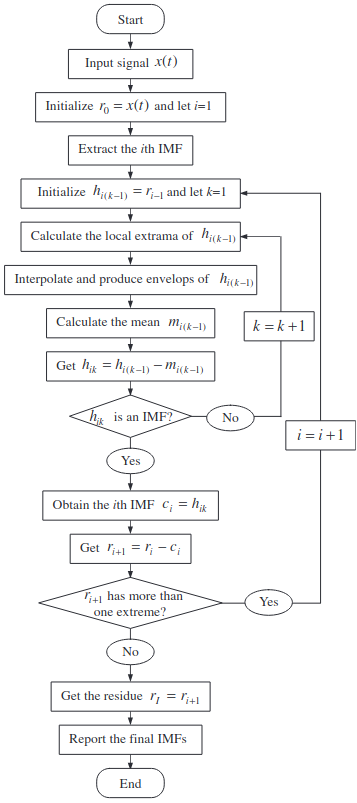

# Background and Motivation
## Motivation
In this project we are seeking to create an educational tool that can be used to interactively explore the differences between two approaches to time series analysis of non-stationary signals. 
The front end only application will allow users to either submit their own signals, or to build one using a library of predefined signal types, and then perform either a Short Time Fourier Transform or a Empirical Mode Decomposition on the signal to break it down into it's constituent component signals.

This will allow them to explore the differences between these two methods for decomposing time signals, serving as a demonstration of their relative strengths and weakness, and providing an intuitive feel for how they work.
The application will also have a number of convenience features for users, such as the ability to bookmark examples, and a pre-generated set of examples that can be used to demonstrate how the application and how the time series analysis techniques work. 

## Background
### Time Series Analysis
A *time series* is a sequence of data points that are indexed or graphed in time order.
Frequently graphed in a run chart (a graph which features time as its $`y`$ axis), time series occur naturally in a wide array of subjects, such as statistics, finance, weather forecasting, and signal processing.

There are a handful of common types of time series that occur widely, for example:
1. Simple sinusoids
1. Linear, exponential, logarithmic, or polynomial trends
1. White, coloured, or shot noise
1. Chirps
1. Products and sums of the above signals, forming complex signals that might be found in the real world 

*Time series analysis* is a set of techniques that can be used in order to reason about time series', enabling an analyst to extract useful insights from the data.

Many time series exhibit an oscillatory behaviour, such as the temperature of a city on any given day of the year, the share price of a given stock, or the audio data recorded by a microphone.
An analyst can exploit the fact that complex signals can be approximated with sums of simpler trigonometric functions and use Fourier analysis to decompose a signal into its oscillatory components.

### Discrete Fourier Transform


A Fourier transform is one way of decomposing a complex signal into its oscillatory components, revealing the frequencies of the constituent component signals.
Determining what component frequencies are present in a signal can give an insight into the nature of a signal, or allow it to be manipulated precisely.
For example, it may allow an audio engineer to silence or boost particular frequencies as they see fit, or a financial analyst to determine what kind of long term trends exist in financial data.
Lets look at an example of a Fourier transform of the previous signal.
We will use the Fast Fourier Transform (FFT) algorithm to compute the transform.


Notice that despite having a strong indication that the constant 3Hz and 18Hz signals are constituent components, much information has been lost.
As a Fourier transform maps a function from the time domain to the frequency domain, all temporal information is lost, as the FFT assumes periodicity.
This is obviously not ideal, as our complex signal is non-linear.
The Fourier transform is thus not well suited to non-linear signals when applied on the entire signal at once.

### Short Time Fourier Transform

Instead, in order to study non-stationary signals, we require a technique that can study a signal in both the time and frequency domain simultaneously.
The simplest of these techniques is the Short Time Fourier Transform (STFT).

The procedure for STFT is to divide a long time signal equally into shorter length segments, and then compute a DFT on each of these segments.
In order to smooth out any unusual artefacts at the boundary of segments, window functions such as a Hann window may be used, which attenuates signals located near boundaries using a cosine window.
With the Fourier spectra of each shorter segment, we can plot the changing spectra against time using a type of plot known as a spectrogram.
Here is an example of STFT applied to our original signal.


Here we can see the strength of each constituent signal by colour intensity.
Unlike previously with the FFT, we now have temporal information, and can see when signals of a given frequency begin and end in the complex signal.

However there is a significant limitation to building on top of Fourier transforms due to an uncertainty limit called the Gabor limit.
By making the time resolution smaller (i.e., by dividing the main signal into smaller windows) we become more certain of when frequencies change, but we lose frequency resolution (the ability to see frequency components close together).
By making the time resolutions larger, we lose time resolution (the ability to know precisely when a frequency changes), but we get better frequency resolution.

### Hilbert-Huang Transform and Empirical Mode Decomposition

The Hilbert-Huang Transform (HHT) is a powerful time-frequency analysis technique.
It allows an analyst to decompose a complex signal into a number of orthogonal Intrinsic Mode Frequencies (IMFs) with a trend using EMD and applies Hilbert Spectral Analysis (HSA) to the IMFs to obtain information regarding instantaneous frequency.

HHT first utilises empirical mode decomposition (EMD) in order to break a complex waveform into IMFs representing simple oscillatory modes through a process called sifting.
The amplitude and frequency of an IMF may vary with time, and must satisfy both of these rules:
1. The total number of extrema and the number of zero crossings must differ by at most 1
2. The mean envelope value (defined by a spline described by the local maxima and the local minima) must be nearly zero

The sifting procedure to extract these IMFs can be described by the following steps:
1. Initialise $`r_0 = X(t)`$ and $`i = 1`$
1. Start outer loop
1. Extract the $`i`$th IMF $`c_i`$
	1. Initialise $`h_{k(k-1)} = r_{i-1}`$, $`k = 1`$
	1. Start inner loop
	1. Identify all of the local maxima and minima (the extrema)
	1. Interpolate the minima with a cubic spline in order to define the lower envelope
	1. Interpolate the maxima with a cubic spline in order to define the upper envelope
	1. Calculate the mean $`m_{i(k-1)}`$ of the upper and lower envelopes of $`h_{i(k-1)}`$. The envelope defined by the two cubic splines should contain all data.
	1. Set $`h_{ik} = h_{i(k-1)} - m_{i(k-1)}`$
	1. Is $`h_{ik}`$ an IMF?
		- If true, set $`c_i = h_{ik}`$ and break
		- Else increment $`k`$ and continue inner loop
1. Set the remainder $`r_{i+1} = r_i - c_i`$
1. Does $`r_{i + 1}`$ contain at least two extrema?
	- If true increment $`i`$ and continue outer loop
	- Else end routine, with $`r_{i + 1}`$ as the signal residue and $`c_1`$ through $`c_i`$ as the IMFs

Below is a flowchart describing this algorithm[^fn1]




And below is an animation of the production of an IMF[^fn2]


The number of sifting steps required to produce an IMF is determined by the stopping criterion.
There are a number of stopping criterion that can be used for EMD, each with their own advantages and disadvantages.
The one proposed by Huang et al. (1998) however is the 'Standard Deviation' method.
For each point in time, the difference between the current component and the previous component is calculated, squared, divided by the square of the previous component evaluated at that point in time, and summed.

```math
SD_{k}=\sum _{{t=0}}^{{T}}{\frac  {|h_{{k-1}}(t)-h_{k}(t)|^{2}}{h_{{k-1}}^{2}(t)}}
```

Once this value falls below a predetermined threshold, the sifting process can be stopped.

There are other stopping criterion that may be used however, such as S Number Criterion or Energy Difference Tracking.

Below we can see an example of EMD being performed on a complex signal, breaking it down into its constituent modes in descending frequency order[^fn3].


At this point, if desired, the instantaneous frequency spectrum can be obtained by applying the Hilbert transform on the constituent IMFs.
The final result would be called a Hilbert spectrum, where the amplitude and instantaneous frequency can be plotted as functions of time on a three dimensional plot.

Unlike STFT, EMD is a self-adaptive signal processing method.
The IMFs are determined by the signal itself, and are representative of the natural oscillatory mode embedded in the signal.
Thus EMD works on the characteristic time local time scale, rather than with predetermined windows.

Of course, EMD has weaknesses as well, for example:

1. EMD suffers from end effects
1. The IMFs may not be orthogonal
1. Mode mixing sometimes occurs between IMFs, where a single IMF includes oscillatory modes that are drastically different or a component of a different IMF all together.

In conclusion, each time-frequency analysis technique has draw backs and advantages, and neither one is conclusively the correct one to use in any given situation.
This being said, for analysing non-stationary signals EMD has some obvious advantages compared to STFT and can be considered superior in most cases [^fn4].

[^fn1]: Lei, Yaguo, et al. "A review on empirical mode decomposition in fault diagnosis of rotating machinery." *Mechanical systems and signal processing 35.1-2* (2013): 108-126. 
[^fn2]: Photograph by Geir Kulia and modified by Matt Hall, distributed under a Creative Commons Attribution-ShareAlike 4.0 license.
[^fn3]: Example adapted from the Jupyter Notebook tutorials created by the developers of Python's `emd` library, available [here](https://emd.readthedocs.io/en/stable/_downloads/e47aacca40568b7bb056bd96535966c4/emd_tutorials_jupyter.zip)

[^fn4]: Arun Raj P.D., Mr. Venkatesh S., "Time-Frequency Analysis methods: A Comparative study", International Research Journal of Engineering and Technology (IRJET),Volume 3, Issue 6, June 2016, e-ISSN: 2395-0056.


